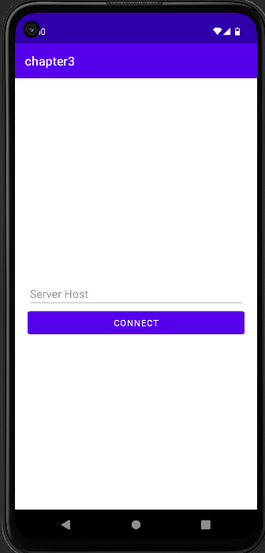
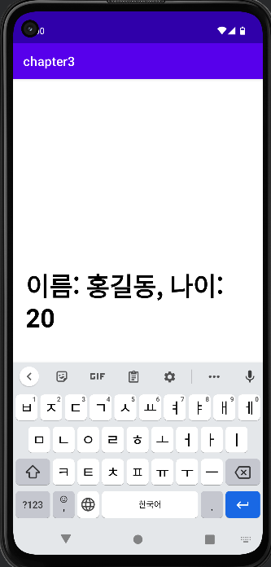

## Android-Advanced-Apps

- [Chapter 1 : 웹툰 앱](https://github.com/NewTurn2017/Android-Advanced-Apps/tree/main/Chapter1)

  - WebView, SharedPreference, Fragment
  - ViewPager, listener Interface
  - WebViewClient

    

- [Chapter 2 : 녹음기 앱](https://github.com/NewTurn2017/Android-Advanced-Apps/tree/main/Chapter2)

  - MediaPlayer
  - MediaRecorder
  - Permission Request
  - Canvas
  - Handler

    

[Chapter 3 : 오늘의 공지앱](https://github.com/NewTurn2017/Android-Advanced-Apps/tree/main/Chapter3)

- ServerSocket으로 간단한 서버구현
- OkHttp
- Gson

   
